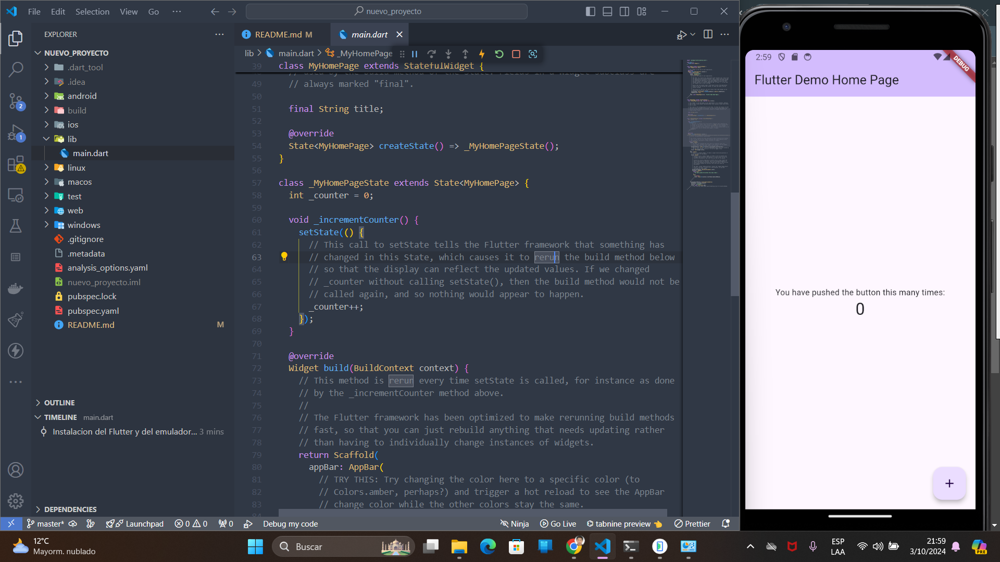

# Guía de instalación y configuración de Flutter en Windows con VS Code

## Índice
1. [Instalación de Flutter](#instalación-de-flutter)
2. [Configuración del entorno en Visual Studio Code](#configuración-del-entorno-en-visual-studio-code)
3. [Instalación de Android Studio y creación de un emulador](#instalación-de-android-studio-y-creación-de-un-emulador)
4. [Creación de un proyecto Flutter](#creación-de-un-proyecto-flutter)
5. [Ejecución y depuración del proyecto con un emulador](#ejecución-y-depuración-del-proyecto-con-un-emulador)

## Instalación de Flutter

### 1. Descarga de Flutter
- Visita la página oficial de Flutter: [https://flutter.dev](https://flutter.dev)
- Descarga el SDK de Flutter para Windows desde [Flutter SDK](https://flutter.dev/docs/get-started/install/windows).

### 2. Configuración de las variables de entorno
1. Extrae el archivo descargado en una carpeta, por ejemplo `C:\dev\flutter`.
2. Agrega Flutter a las variables de entorno:
   - Abre el Panel de Control → Sistema y Seguridad → Sistema → Configuración avanzada del sistema.
   - Haz clic en **Variables de entorno**.
   - Selecciona la variable `Path` en **Variables del sistema** y haz clic en **Editar**.
   - Haz clic en **Nuevo** e ingresa la ruta donde extrajiste Flutter, por ejemplo: `C:\src\flutter\bin`.
   - Guarda los cambios.

### 3. Verificar la instalación
Abre una terminal de Windows (CMD o PowerShell) y ejecuta el siguiente comando para verificar la instalación:

```bash
flutter doctor
```

Este comando verificará si todas las herramientas necesarias están instaladas y configuradas correctamente. Si alguna dependencia está incompleta, el comando te sugerirá los pasos necesarios para solucionarlo.

## Configuración del entorno en Visual Studio Code

### 1. Instalar Visual Studio Code
- Descarga e instala Visual Studio Code desde [VS Code](https://code.visualstudio.com/).

### 2. Instalar extensiones de Flutter y Dart
1. Abre VS Code.
2. Ve a la sección de **Extensiones** en la barra lateral izquierda (o presiona `Ctrl+Shift+X`).
3. Busca las siguientes extensiones e instálalas:
   - **Flutter**
   - **Dart**

## Instalación de Android Studio y creación de un emulador

### 1. Descargar e instalar Android Studio
- Descarga e instala Android Studio desde [Android Studio](https://developer.android.com/studio).

### 2. Configurar el SDK de Android
1. Abre Android Studio.
2. Ve a **SDK Manager** desde el menú **Configure** en la pantalla de bienvenida o desde **File > Settings > Appearance & Behavior > System Settings > Android SDK**.
3. Asegúrate de tener instalado:
   - **Android SDK Platform-Tools**
   - **Android SDK Build-Tools**
   - **Emulator**
   - **Android System Image** para cualquier versión de Android que desees emular.

### 3. Crear un emulador Android
1. Abre Android Studio.
2. Ve a **AVD Manager** desde el menú **Configure** o selecciona **Tools > AVD Manager** en la barra de herramientas.
3. Haz clic en **Create Virtual Device**.
4. Elige un dispositivo (por ejemplo, Pixel 4) y haz clic en **Next**.
5. Selecciona la versión de Android que quieras emular y haz clic en **Next**.
6. Confirma la configuración y haz clic en **Finish**.

## Creación de un proyecto Flutter

### 1. Crear un proyecto en Flutter
1. Abre una terminal en VS Code o usa la terminal de Windows (CMD o PowerShell).
2. Ejecuta el siguiente comando para crear un nuevo proyecto de Flutter:

```bash
flutter create nombre_de_mi_proyecto
```
Reemplaza `nombre_de_mi_proyecto` con el nombre que desees para tu proyecto.

### Navega al directorio del proyecto:
```bash
cd nombre_de_mi_proyecto
```
## Ejecución y depuración del proyecto con un emulador

### 1. Iniciar el emulador
- Abre Android Studio y ve al **AVD Manager**.
- Inicia el emulador haciendo clic en el ícono de **Play** junto al dispositivo que has creado.

### 2. Ejecutar el proyecto en Flutter
1. En VS Code, abre el proyecto creado.
2. Abre la terminal integrada en VS Code (presiona `Ctrl+` `` ` ``).
3. Verifica que el emulador esté conectado:

   ```bash
   flutter devices
    ```
4. Debes ver el emulador en la lista de dispositivos disponibles.

### 3. Ejecuta el proyecto en el emulador:

```bash
flutter run
```

Esto iniciará el proyecto Flutter en el emulador.

### 4. Depuración del proyecto
- Puedes agregar puntos de interrupción y depurar tu código directamente en VS Code utilizando la pestaña de Run and Debug.
- Para detener la ejecución, puedes presionar q en la terminal donde está corriendo el emulador o usar los controles de ejecución y depuración de VS Code.
  
¡Listo! Ahora tienes todo configurado para desarrollar, ejecutar y depurar aplicaciones Flutter en tu entorno de desarrollo en Windows.

### ANEXO

